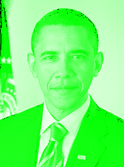

Tancolor
========

A jQuery plugin that processes image using filter algorithm. It currently
processes image into grayscale, bluescale, greenscale, redscale and more to 
come.

Example
=======

The example is provided in the example folder.

Dependencies
============

*  [jQuery](https://github.com/jquery/jquery)

Install
=======

Download the repository and point to the jquery plugin:

    
    
or

    
    

Usage
=====

By default, this plugin converts image into grayscale. The most simple usecase
is as follow:

    $("#myImageID").tancolor();
    
This results in:

It also offers red, green and blue filter.

Red
---

    $("#myImageID").tancolor({
        mode: "red"
    });
    

Green
-----

$("#myImageID").tancolor({
        mode: "green"
    });
    

Blue
----

$("#myImageID").tancolor({
        mode: "blue"
    });
    

Motivation
==========

Sometimes during web development, we only need some small tweak on the existing image to tryout color combination. Switching between image processing software such as GIMP or Photoshop can consume a fair amount of time. This plugin provides a quick image processing to achive that. Hopefully, in the future, it will become mature that can help programmer to save time.

